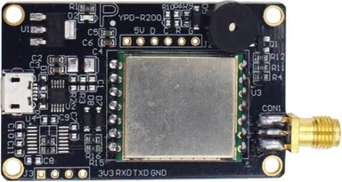

# arduino-rfid-R200
Arduino/ESP32 code for R200 long-range UHF RFID reader

The R200 is a UHF RFID module based on the EPC Gen-2 (ISO18000-6C) protocol. What does that mean in practice?
Well, it can read up to 60 tags per second, at a range of 20m...

The board I bought uses a serial interface, so it's pretty easy to control from an ESP32/Arduino/RaspPi. But, I found it a little hard to find much detailed information on the commands or format of the response; which is what I will now document in this respository.

This is the module I bought from https://www.aliexpress.com/item/4000281733851.html

Note that the board uses an external ceramic antenna, and the read range will vary depending on the physical size (and therefore dbi) of the antenna. I chose the 60x70x7mm 4dbi antenna, which claims a read range of 0-3m.

## Wiring
The module runs at 3.3V but doesn't seem to be able to draw enough current to operate if only supplied from the 3.3V pin. So, supply VIN with 5V but otherwise interface at 3.3V

Here is how I've wired it to use the Serial2 UART interface on the ESP32:

## Disable Beeper
By default, the board will beep every time a tag is recognised. While this is very useful for debugging, it's often not desirable for production use! 
As shown in the [schematic](https://github.com/playfultechnology/arduino-rfid-R200/blob/main/docs/R200%20%20SCH.pdf), the beeper is wired to 5V through a 0Ω resistor at R9, so desoldering this will prevent it from beeping.
(Alternatively, you can desolder R11 to prevent the signal line to the transistor that activates the beeper.

## Code
The R200 code in the repository will print the EPC (i.e. tag ID) of all cards detected

